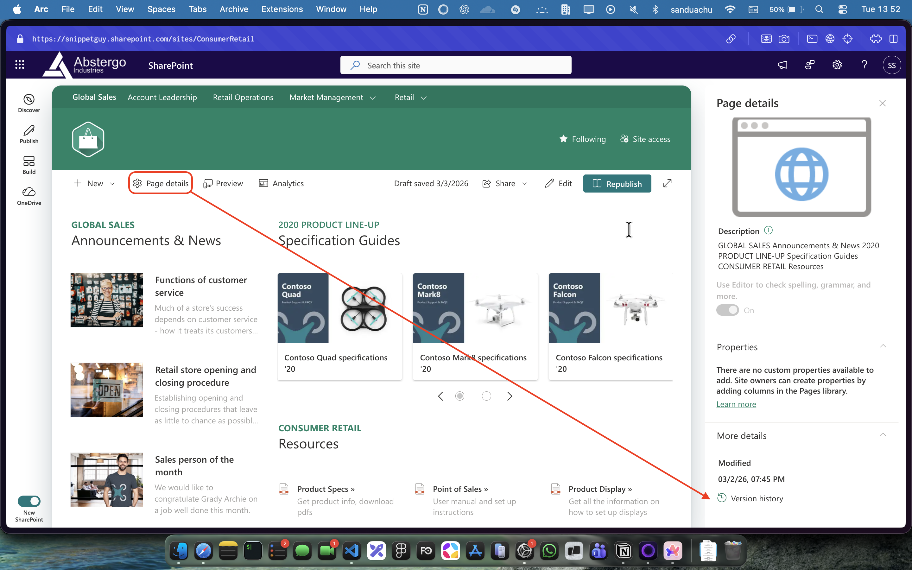
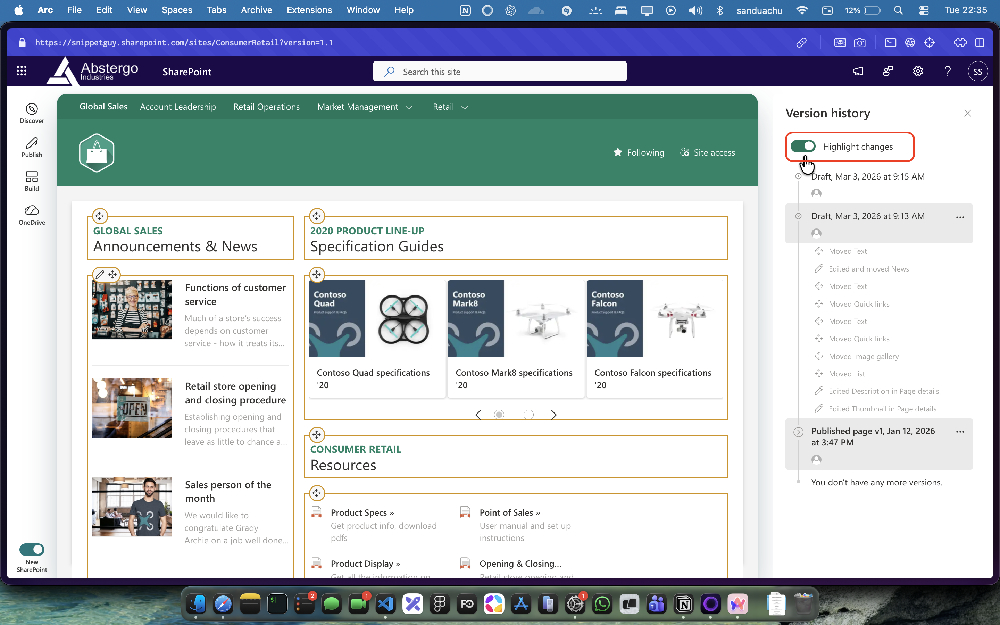
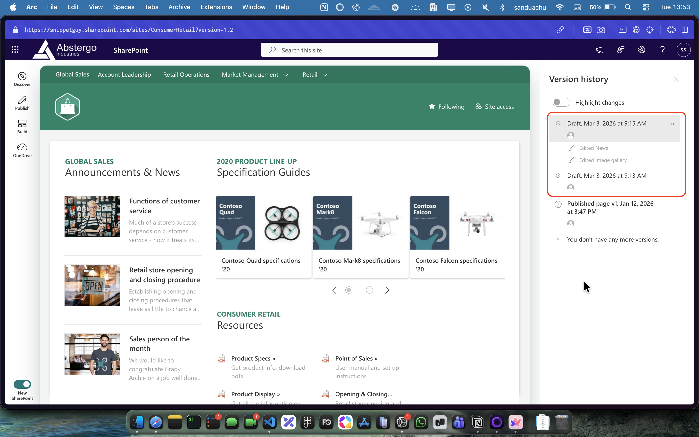
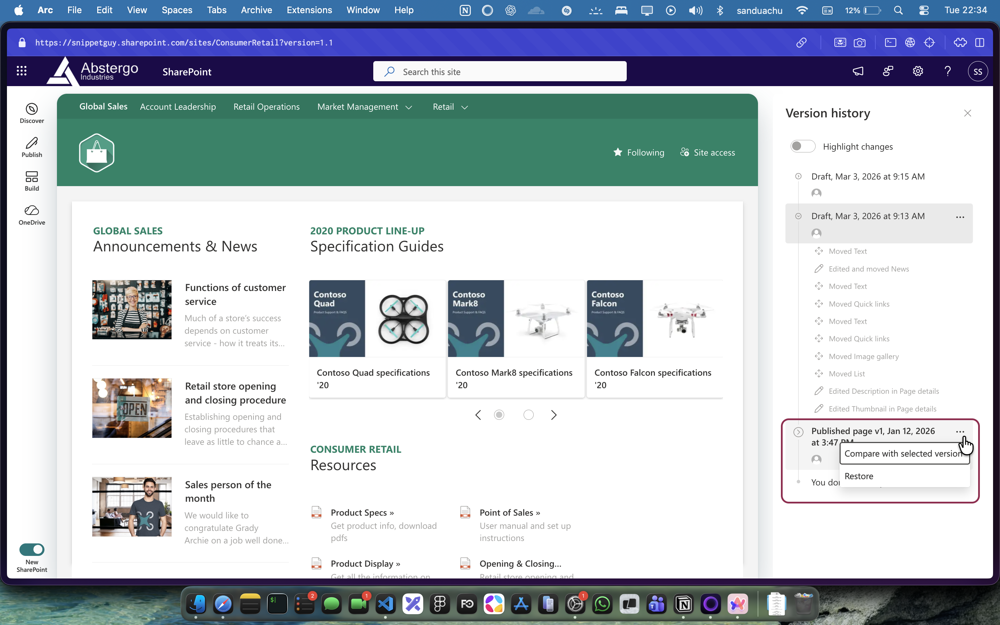

# You're Checking SharePoint Page Version History the Wrong Way

Every content editor, SharePoint developer and site owner has been there. A page looks different than it did last week. Something changed. You need to figure out what, and who did it.

So you head to the Site Pages library, right-click the page, and click **Version History**. The list shows up. You breathe easy.

But here's the problem. That version history only shows you when the page file itself was modified at a library level. It doesn't show you the granular editorial changes inside the page — the text edits, the web parts added or removed, the section layouts shifted around. You're looking at the wrong thing.

There's a better way, and it's been sitting right there in the page itself.

---

## The Correct Way to View Page Version History

Open the page you want to inspect. In the top command bar, click **Page details**. This opens the property pane on the right side of the screen. Scroll down to the bottom of that pane, and you'll find the **Version History** link.

This is the real version history for site pages. It shows every saved version — including drafts that were never published — with timestamps and the names of who made the changes.

---

## Highlight Changes: The Feature Most People Miss

Once you're in the version history, click on any version. You'll see a **Highlight Changes** option at the top.

Enable it and SharePoint visually marks exactly what changed in that version — added content, removed content, modified sections. You don't have to manually compare two versions in your head. The page shows you.

This is especially useful when a page has multiple editors and you're trying to track down one specific change.

---

## Draft Versions Are Visible Here Too

The version history here doesn't just show published versions. If an editor saved a draft without publishing, that version shows up as well.

This matters when you're trying to understand what was in progress, or when content went live that shouldn't have — you can check whether it was sitting in draft first.

---

## Comparing Versions

For published versions, click the ellipsis next to any entry. You'll see the option to **Compare with selected versions**.

Select two versions and SharePoint shows you a side-by-side diff. This is how you make a confident decision about whether to restore an older version or keep what's current.

---

## Quick Recap

The next time you need to audit changes on a SharePoint site page:

- Open the page directly
- Click **Page details** in the top right
- Scroll to the bottom of the property pane
- Click **Version History**

Skip the Site Pages library route. It doesn't give you what you actually need.