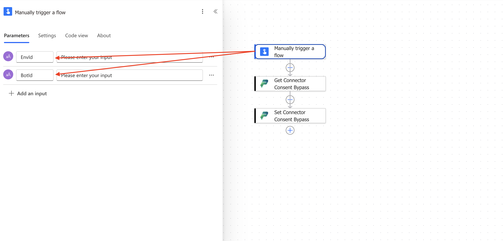
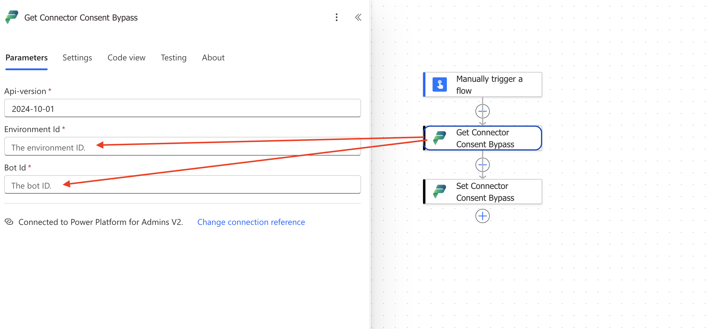
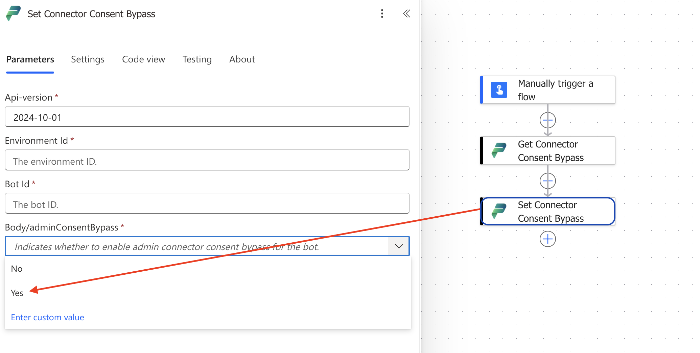

# Fixing the Copilot Studio Consent Loop: Connector Consent Bypass Using Power Automate

If you've built agents in Copilot Studio that use connectors, you've probably hit this: the consent confirmation shows up once, you approve it, and then it shows up again. And again. Every session, sometimes every run.

I ran into this while working on Copilot Studio agents and it was, without question, the most frustrating part of the build. Approving something once should mean it's approved. It wasn't.

## First, I checked if it was just me

I reached out to a few fellow MVPs to see if they were hitting the same wall. They were. So I raised a ticket with Microsoft to get a definitive answer.

Confirmed: this is an issue on Microsoft's side. The consent confirmation has to be given every single time, regardless of prior approval.

The commonly suggested workaround is switching to maker credentials. I'd avoid that. It doesn't respect individual user permissions, and it's not a fit for most production scenarios you lose the per-user context that makes the agent behave correctly in the first place.

## The fix, published yesterday

While searching Microsoft documentation yesterday, I found this: [Manage admin connector consent bypass for Copilot Studio agents](https://learn.microsoft.com/en-us/microsoft-copilot-studio/admin-connector-consent-bypass). Publish date yesterday.

Administrators can now bypass the consent card for a specific agent, the same way it already works for Power Apps, using the connector consent-bypass setting exposed through the [Power Platform API](https://learn.microsoft.com/en-us/rest/api/power-platform).

I had 7 agents across two business divisions sitting right on the edge of moving to production. Tested the bypass on both immediately.

It worked.

### Prerequisites

Your signed-in account needs one of these Microsoft Entra roles:

- Power Platform Administrator (least privilege of the three)
- AI Administrator
- Global Administrator

If you'd rather script this, Microsoft's Learn documentation covers a PowerShell approach. I went with Power Automate instead, mainly to keep this repeatable and easy to hand off to other admins on the team without them needing to touch PowerShell.

## Setting it up in Power Automate

Here's the flow, step by step.

### 1. Create a manual flow with two inputs

Set up a manually triggered flow. Add two text inputs: `EnvironmentId` and `BotId`.

### 2. Add "Get Connector Consent Bypass"

Search for this action it's under the Power Platform Admins connector category. Feed it the `EnvironmentId` and `BotId` from your trigger.

This action returns the current admin connector consent bypass setting for that bot, so you know the state before you change anything.

### 3. Add "Set Connector Consent Bypass"

Below the Get action, add "Set Connector Consent Bypass," also under Power Platform Admins. Use the same `EnvironmentId` and `BotId` values for the bot you're targeting. Set `adminConsentBypass` to `true`.

This field indicates whether admin connector consent bypass should be enabled for the bot. If you ever need the consent card back for testing, or to revert a specific agent set this same field to `false` and rerun the flow.

### 4. Run it

Trigger the flow, pass in the `EnvironmentId` and `BotId` for the agent you want to fix, and you're done. No more repeated consent prompts for that bot.

## Where this leaves things

7 agents, 2 business divisions, zero consent loops left. This is the kind of fix that doesn't show up in a changelog with fanfare, but it removes a genuine blocker for anyone trying to get Copilot Studio agents into production with connectors attached.

If you're maintaining agents at any real scale, check your Entra role, grab the two IDs, and run through the flow above. Takes a few minutes.

**Reference:** [Manage admin connector consent bypass for Copilot Studio agents – Microsoft Learn](https://learn.microsoft.com/en-us/microsoft-copilot-studio/admin-connector-consent-bypass)